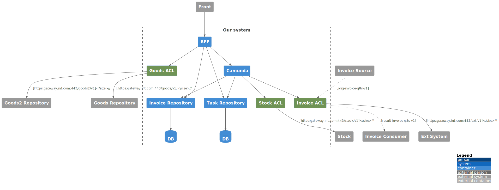

# Architecture As Code Tests

Пример покрытия тестами микросервисной архитектуры, описанной в [plantuml](https://plantuml.com/ru/)

## Архитектура

## Тесты
1. [Finds diff in configs and uml containers](https://github.com/razonrus/aact/blob/721edde3767dc0e51d19c80c3b6adba9fbf7b007/test/architecture.test.ts#L43C10-L43C48) — проверяет актуальность списка микросервисов на архитектуре и в [конфигурации инфраструктуры](https://github.com/razonrus/aact/tree/main/kubernetes/microservices)
2. [Finds diff in configs and uml dependencies](https://github.com/razonrus/aact/blob/721edde3767dc0e51d19c80c3b6adba9fbf7b007/test/architecture.test.ts#L52C9-L52C9) — проверяет актуальность зависимостей (связей) микросервисов на архитектуре и в [конфигурации инфраструктуры](https://github.com/razonrus/aact/tree/main/kubernetes/microservices)
3. [Check that urls and topics from relations exists in config](https://github.com/razonrus/aact/blob/721edde3767dc0e51d19c80c3b6adba9fbf7b007/test/architecture.test.ts#L86C5-L86C5) — проверяет соответствие между параметрами связей микросервисов (REST-урлы, топики kafka) на архитектуре и в [конфигурации инфраструктуры](https://github.com/razonrus/aact/tree/main/kubernetes/microservices)
4. [Only acl can depence from external systems](https://github.com/razonrus/aact/blob/721edde3767dc0e51d19c80c3b6adba9fbf7b007/test/architecture.test.ts#L111C7-L111C49) — проверяет, что не нарушен выбранный принцип построения интеграций с внешними системами только через ACL (Anti Corruption Layer). Проверяет, что только acl-микросервисы имеют зависимости от внешних систем.
5. [Connect to external systems only by API Gateway or kafka](https://github.com/razonrus/aact/blob/721edde3767dc0e51d19c80c3b6adba9fbf7b007/test/architecture.test.ts#L127C16-L127C16) — проверяет, что все внешние интеграции идут через API Gateway или через kafka
